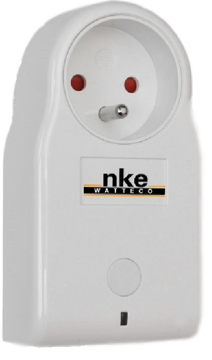

(user_guide)=
# ESS Dataset: A Novel Curated Dataset for Fine-grained Analysis XGen-ESS
> **New ⚡️**
> This is our new dataset (ESS V0.2)

The **Energy Sensing and Smart Meter (ESS) dataset** for Non-Intrusive Load Monitoring (NILM) is a comprehensive and valuable resource designed specifically for studying and developing load disaggregation algorithms. This dataset provides researchers and practitioners with extensive insights into residential energy consumption patterns, allowing them to estimate individual appliance energy usage within households accurately.

**Dataset Description:**

- **Appliance Diversity:** The ESS dataset contains data from more than 12 different appliances commonly found in households. This wide range of appliances, including refrigerators, washing machines, ovens, air conditioners, and more, ensures a comprehensive analysis of energy consumption patterns across various devices. Researchers can benefit from the dataset's diversity to develop models that can accurately identify and differentiate between different appliance types based on energy consumption signatures.

- **Forecasting Capability:** In addition to load disaggregation, the ESS dataset offers the potential for energy forecasting tasks. With its high-frequency time series data and extensive duration, the dataset enables the development and evaluation of forecasting models that can predict future energy consumption accurately. This forecasting capability is particularly useful for optimizing energy management systems and implementing demand response strategies.

- **Granular Measurements:** The ESS dataset provides detailed measurements of various electrical parameters, such as voltage, current, power, reactive power, and apparent power. These measurements are recorded at high frequencies, typically at intervals of 1Hz or 15Hz, offering granular insights into the behavior and characteristics of individual appliances. Researchers can leverage this detailed information to understand the power profiles of different appliances and design algorithms that can accurately disaggregate the total energy consumption into appliance-level contributions.

- **Long Duration:** The ESS dataset captures energy consumption data over extended periods, ranging from a few days to multiple years. This long duration of data collection allows for a comprehensive analysis of long-term energy usage patterns and facilitates the development of robust algorithms. Researchers can explore seasonal variations, daily usage patterns, and trends in energy consumption to gain valuable insights into household behavior and identify opportunities for energy efficiency improvements.

By leveraging the ESS dataset, researchers and practitioners in the field of NILM can delve into the complexities of load disaggregation, energy forecasting, and behavior analysis. The dataset's richness, diversity, and extended duration offer an invaluable resource for advancing energy efficiency, promoting sustainable practices, and developing intelligent energy management systems in residential settings.

Researchers interested in accessing the ESS dataset can explore the relevant sources or repositories associated with the dataset to obtain specific details, access procedures, and licensing terms.


# Datasheet of ESS 

The ESS dataset for Non-Intrusive Load Monitoring (NILM) is collected using a combination of smart plugs and aggregate power measurements. This approach allows for the precise monitoring and measurement of individual appliance energy consumption as well as the overall power consumption of a household. Let's explore in detail how this data collection process works:

1. **Smart Plugs:** Smart plugs are utilized to monitor the energy consumption of individual appliances in a non-intrusive manner. These plugs are connected between the electrical outlet and the appliances of interest. They are equipped with advanced sensing capabilities that can measure and record the electrical parameters, such as voltage and current, as well as calculate power consumption.

2. **Data Acquisition:** The smart plugs are designed to capture high-frequency measurements of the connected appliances. They record the electrical parameters at a rapid rate, typically at intervals of 1Hz or higher, providing a detailed view of the energy consumption patterns. These measurements are time-stamped to maintain the temporal order of the data.

3. **Appliance Identification:** To associate the recorded measurements with specific appliances, each smart plug is labeled or assigned to a particular device or appliance in the household. This labeling process can be done manually by mapping each plug to its corresponding appliance or through automated methods using machine learning techniques. The aim is to establish a clear correspondence between the recorded data and the appliances under monitoring.

4. **Aggregate Power Measurement:** In addition to the individual appliance measurements, the ESS dataset also incorporates aggregate power measurements. These measurements capture the total power consumption of the entire household. This is achieved by connecting a smart plug to the main power supply or electrical panel to monitor the aggregate power usage.

5. **Synchronization:** To ensure accurate and synchronized data, the smart plugs are typically synchronized with a common time reference. This synchronization allows for the alignment of measurements across different appliances and the aggregate power monitoring device, enabling a coherent and consistent dataset.

6. **Data Storage and Management:** The collected data from the smart plugs and the aggregate power monitoring device is stored in a structured format, such as a time-series database. Each recorded measurement is associated with a timestamp, appliance label, and corresponding electrical parameters. This structured storage facilitates easy retrieval, analysis, and processing of the dataset.

By combining the data from the smart plugs and the aggregate power measurements, the ESS dataset provides a comprehensive view of energy consumption at both the individual appliance level and the household level. This integrated approach enables researchers to analyze appliance-specific energy patterns, perform load disaggregation, and develop algorithms for energy forecasting and demand management.

It is worth noting that the specific details of the data collection process, including the smart plug models, communication protocols, and data storage mechanisms, may vary depending on the implementation and the research project. However, the fundamental principle remains consistent, focusing on capturing individual appliance energy consumption through smart plugs and monitoring aggregate power to provide a holistic view of energy usage in residential settings.


Apologies for the oversight. Here's the updated version with the tables in markdown code:

# Dataset Setup Procedure

We use a SmartPlug shown in Figure 1 which allows us to control electrical devices and monitor the quality of the electrical mains. Here are the key applications and features of the SmartPlug:

<p align="center">

</p>

**Device Control:** The primary function of the SmartPlug is to control electrical devices by providing power or cutting off the power supply. The SmartPlug is connected to a wall socket, and the device to be controlled is plugged into the SmartPlug's socket. This allows users to remotely control the power status of the device through the LoRaWAN network.

**Power Consumption Monitoring:** The SmartPlug also measures the power consumption of the connected electrical device. It provides valuable information about energy usage (see Table 1). The following table presents the measured values and their corresponding units:

| Measurement                       | Unit          |
|-----------------------------------|---------------|
| Active Energy                     | W.h           |
| Reactive Energy                   | VAR.h         |
| Accumulation duration for energies| Number of seconds |
| Active Power                      | W             |
| Reactive Power                    | VAR           |

**Main Quality Evaluation:** In addition to device control and power consumption monitoring, the SmartPlug assesses the quality of the electrical mains it is connected to. It provides indicators to evaluate various aspects of mains quality. The following Table 2 summarizes the available indicators:

| Measurement       | Description                                                  | Unit           |
|-------------------|--------------------------------------------------------------|----------------|
| Frequency         | Current frequency seen by the SmartPlug                       | $(x+22232)$ (Hz/1000) |
| Frequency min.    | Minimum frequency seen by the SmartPlug                       | $(x+22232)$ (Hz/1000) |
| Frequency max.    | Maximum frequency seen by the SmartPlug                       | $(x+22232)$ (Hz/1000) |
| VRMS              | Current Root Mean Square Voltage of the main signal seen by the SmartPlug | (V/10) |
| VRMS min.         | Minimum Root Mean Square Voltage of the main signal seen by the SmartPlug | (V/10) |
| VRMS max.         | Maximum Root Mean Square Voltage of the main signal seen by the SmartPlug | (V/10) |
| OverVoltageNumber | Counter for voltage peaks exceeding the "Over voltage Threshold" | Counter |
| SagNumber         | Counter for voltage sags below the "Sag voltage Threshold"     | Counter |
| BrownoutNumber    | Counter for SmartPlug reboots                                 | Counter |

With these capabilities, the SmartPlug offers convenient device control, power consumption monitoring, and assessment of the electrical mains' quality.

**An example of data collection with 7 submeters:**

```python
instance: 1 # this is the first building in the dataset
elec_meters: {} # a dictionary where each key is a meter
  1: site_meter: true # meter 1 measures the whole-building aggregate
  2: site_meter: true
  3: submeter_of: 1 # meter 3 is directly downstream of meter 1
  4: submeter_of: 1
  5: submeter_of: 2
  6: submeter_of: 2
  7: submeter_of: 6
appliances:
- {type: kettle, instance: 1, room: kitchen, meters: [3]}
- {type: washing machine, instance: 1, meters: [4,5

]}
- {type: fridge, instance: 1, meters: [2]}
- {type: dish washer, instance: 1, meters: [6]}
- {type: light, instance: 1, room: kitchen, meters: [7]}
- {type: light, instance: 2, multiple: true, meters: [6]}
```

**Detailed experiments set-up:**

We compare the corresponding classes in our dataset with the most widely used datasets in the field of energy. Our dataset has more classes than Ukdale and REDD cited in most articles, which overcomes the possibility of these types of schemes being invisible.

| Sr. | Dataset            | Country | Houses | Classes | Variety     | Purpose of Appliances                                                                                                                      |
|-----|--------------------|---------|--------|---------|-------------|-------------------------------------------------------------------------------------------------------------------------------------------|
| 1   | XGen-ESS (ours)   | France  | 7 ↑    | 19 ↑    | Residential | lighting, TV, laptop, play\_station, stove, washing\_machine, oven, refrigerator, kettle, microwave, dishwasher, water\_heater, freezer, outlets, microwave, heater, clothes\_dryer, PC |
| 1   | REDD [20]         | USA     | 6      | 10      | Residential | electronics, lighting, refrigerator, disposal, dishwasher, crazy-washer, washer-dryer, outlets, microwave oven, heater, stove, clothes-dryer, AC                                                |
| 2   | BLUED              | USA     | 1-3    | ~13     | Residential | Desklamp, chopper, refrigerator, A/V system, computer, laptop, receiver/DVR/Blueray player, compressor, monitor, TV, hair-dryer, iron, lights                                                      |
| 3   | UK-DALE [32]      | UK      | 5      | 1--5    | Residential | Fridge freezer, home theatre PC, dishwasher, washer-dryer, kettle                                                                       |


```{toctree}
:hidden:
:caption: About our ESS Dataset?
De
Introduction
XarrayforXGenTS
CreatingInferenceData
WorkingWithInferenceData
```